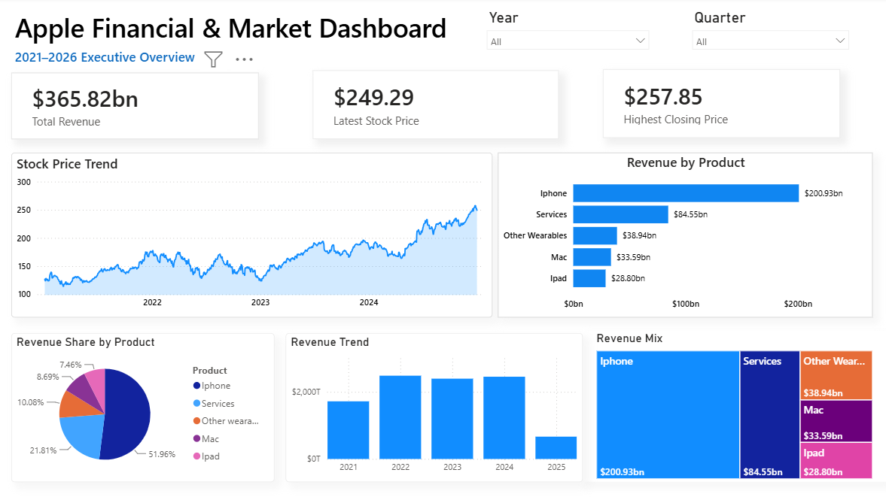

# Apple Financial & Market Dashboard

## Project Overview

This Power BI dashboard analyzes Apple's financial and stock market performance between 2021 and 2026.

### Tools
- Power BI
- Power Query
- DAX
- Excel

### Dashboard Features
- Executive KPI Cards
- Stock Price Trend
- Revenue Trend
- Revenue by Product
- Revenue Share Analysis
- Interactive Year & Quarter Filters

### Business Insights
- Total Revenue by Year
- Highest Closing Stock Price
- Product Revenue Contribution
- Historical Stock Performance

## Dashboard Preview

